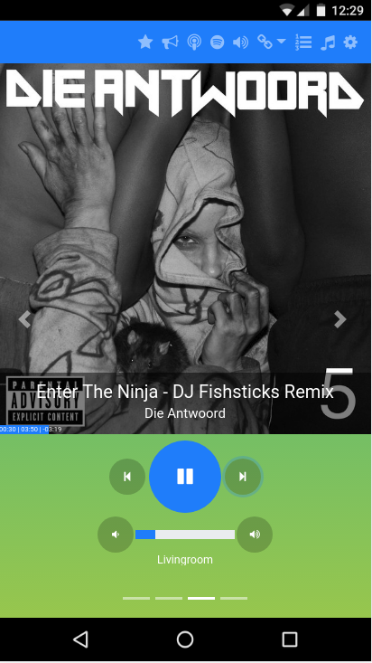
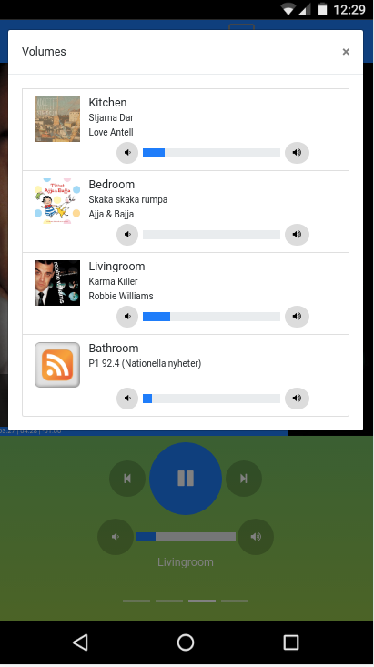
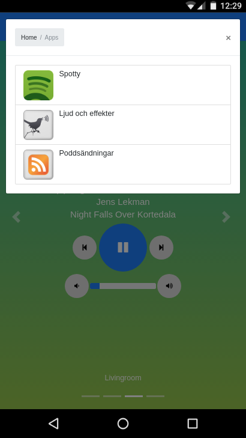

# Responsive / Mobile skin for Logitech media server / Squeezeserver

 
 
 

## Installation

Copy (or symlik) ```m/``` directory to server skin directory (e.g. ```/usr/share/squeezeboxserver/HTML/m```)
Example
```
cp -a m /usr/share/squeezeboxserver/HTML/m
```

## Usage

Access the skin through ```http://yourserver:9000/m/```.
Select "add to start screen" in your device, if supported.

## Development

It helps turning off the server HTML cache, by appending ```--nobrowsecache``` when starting squeezeboxserver.

The development directory can be mounted in a docker container for easy development.
Example:

```
docker pull molobrakos:lms
docker run -d --name lms \
       -p 9000:9000 \
       -p 3483:3483 \
       -p 3483:3483/udp \
       -v /etc/localtime:/etc/localtime:ro \
       -v $CONFIG_DIR:/config \
       -v $CACHE_DIR:/cache \
       -v $LOG_DIR:/logs \
       -v $MUSIC_DIR:/music \
       -v $HOME/src/lms-mobileskin/m:/usr/share/squeezeboxserver/HTML/m:ro \
       molobrakos:lms \
       --nobrowsecache
```
